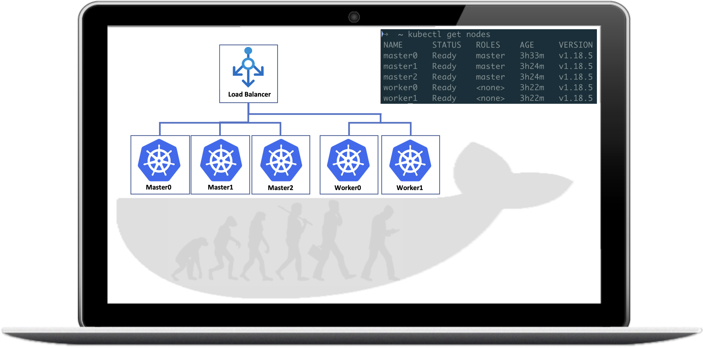

# Kubernetes The Hard Way on Docker

It's a must-have skill along the CKA journey by using not just `kubectl`, but administrator tools like `kubeadm` to build Kubernetes cluster from scratch.

While reviewing the [`Kubernetes the Kubeadmin Way`](https://github.com/brightzheng100/kubernetes-the-kubeadm-way) I compiled last year, during my CKA preparation, well, I feel that it's quite costly on any of cloud providers and I won't suggest you to do so just for practice purposes.

There are a lot of great tools which can help you craft a Kubernetes cluster within minutes on Docker, like:

- **[kind](https://github.com/kubernetes-sigs/kind)**
- **[K3d](https://github.com/rancher/k3d)**

But, we want **the hard way** instead of automated way so we can learn more.

That's the motivation of this repo and I'll guide you through to:

1. build a set of workable Docker images;
2. spin up the Kubernetes nodes by Docker containers;
3. bootstrap and eventually build a "fully-fledged" multi-node Kubernetes, on Docker, within exactly your laptop!

## Target Audience

The target audience for this tutorial is someone planning to build highly available OSS Kubernetes clusters by purely using the **official** tooling `Kubeadm`, simply **on your laptop's Docker**, without any real $$$ cost like what we do on cloud providers!

## OS, Tools, Components and Versions

* Working Laptop: MacBook Pro with macOS Catalina, but I believe it should work wherever Docker runs
* Docker Desktop with Engine v19.03.8
* [kubeadm](https://kubernetes.io/docs/setup/production-environment/tools/kubeadm/install-kubeadm/) v1.18.5, as of writing
* [kubernetes](https://github.com/kubernetes/kubernetes) v1.8.5, as of writing
* [containerd](https://containerd.io/) v1.3.4
* [runc](https://github.com/opencontainers/runc) v1.0.0-rc90
* Any of the CNIs, like:
  * [weavenet](https://github.com/weaveworks/weave) v2.6.5
  * [cilium](https://github.com/cilium/cilium) v1.8

## Labs

This tutorial assumes you have Docker installed.

* [01-build-images](docs/01-build-images.md)
* [02-spinup-containers-as-nodes](docs/02-spinup-containers-as-nodes.md)
* [03-prepare-all-nodes](docs/03-prepare-all-nodes.md)
* [04-bootstrap-control-plane](docs/04-bootstrap-control-plane.md)
* [05-join-nodes](docs/05-join-nodes.md)
* [06-install-cni-plugin](docs/06-install-cni-plugin.md)
* [07-access-it-from-laptop](docs/07-access-it-from-laptop.md)
* [08-clean-up](docs/08-clean-up.md)

## Materials / References

* `/images`: the images I use to spin up the cluster, with `Dockerfile`s inside
* `/config`: the folder structure and files I use to configure and bootstrap the Kubernetes
* `/docs`: the step-by-step labs

## Furture Works

* To do more research to rebuild the core [k8s-ready](quay.io/brightzheng100/k8s-ready:ubuntu.20.04) image with bare minimum components pre-installed;
* To spin up the containers by using [footloose](https://github.com/weaveworks/footloose) instead of bash scripts
